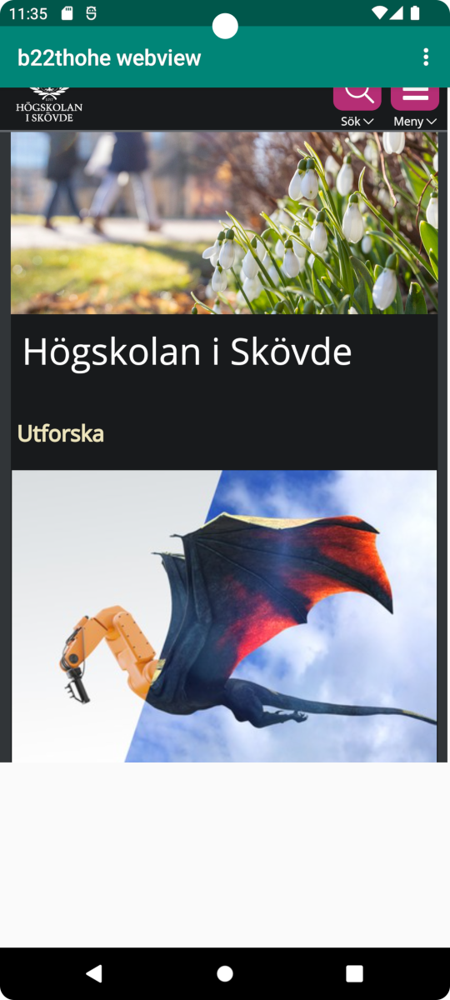
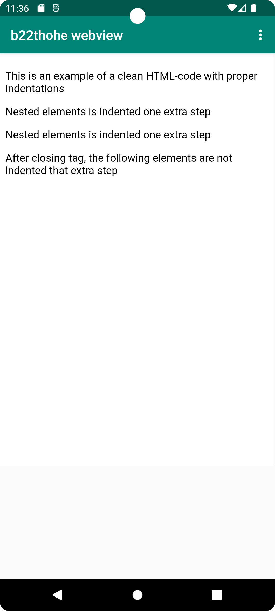

# Report

The app name was changed to “b22thohe webview” in strings.xml and internet access was enabled in 
AndroidManifest.xml. The existing textview element was deleted and a webview element was placed
instead and given the id "my_webview". This part was done using the graphical user interface.

These changes was push to the Github repository.

The MainActivity.java file was opened in the editor and a variable named "myWebView" was added. This
required the addition of an import statement with the WebView class.

In the onCreate method, the webview element was located by its id and assigned to a variable. A new 
WebViewClient was created and set to the webview element. These changes are shown in this code
listing:

```
myWebView = findViewById(R.id.my_webview);
myWebView.setWebViewClient(new WebViewClient());
```

These changes was push to the Github repository.

Javascript execution was enabled which required import of the WebSettings class. A statement to load
a URL into the webview element.

These changes was push to the Github repository.

The URL load statement was moved into the showExternalWebPage() and showInternalWebPage() methods.
An assets folder was created and the file "about.html" was added to it. The URL load statement in
the in showInternalWebPage() method was edited to point to about.html.

Inside the onOptionsItemSelected() method, calls were added to the show webpage methods to trigger 
them when menu options are selected by the user:

```
if (id == R.id.action_external_web) {
    Log.d("==>","Will display external web page");
    showExternalWebPage();
}

 if (id == R.id.action_internal_web) {
    Log.d("==>","Will display internal web page");
    showInternalWebPage();
 }
```

These changes was push to the Github repository.

A faulty statement was discovered on line 23 in MainActivity.java and was corrected. This change was 
committed and pushed to Github.

The app was tested in the emulator with successful result (see Image 1 and 2).

**Image 1 - External webpage **  <br/><br/>



**Image 2 - Internal webpage **  <br/><br/>


A final commit and push was made for this file to be uploaded.
